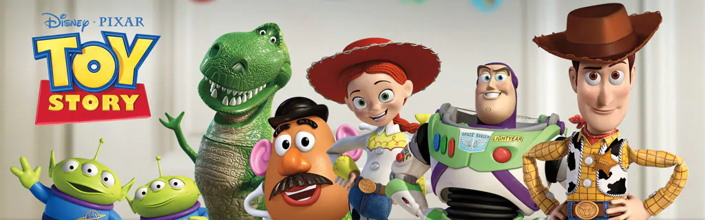

# React Click Game: [A Toy Story](https://awilliams62090.github.io/clicky-game/)

 ### My first app with React is a game where the player tries to click as many characters as they can without clicking on the same one more than once. And of course, It's a Toy Story theme, because it is one of the greatest Pixar films of all time.

## Installation 
### This project was bootstrapped with [Create React App](https://github.com/facebook/create-react-app).

